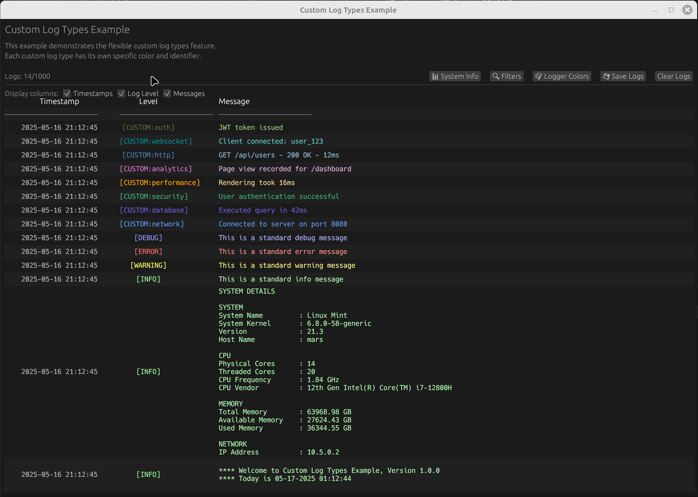

<div align="center">
</img>

# egui_lens 
*Magnifying the surface of an egui application*

[](https://github.com/emilk/egui)

[](https://crates.io/crates/egui_lens)


</div>

`egui_lens` is a **modular and customizable reactive event logger component** for egui applications. It provides a terminal-like interface for displaying log messages with advanced filtering and configuration options.

All UI features come **ready-to-use out of the box** - including custom log colors, selectable columns, filtering options, and file export capabilities with no additional configuration required.

This crate is part of the **egui_mobius** software stack and enables rapid construction of terminal-based applications for professional desktop-quality interfaces. 

## Features

- **Real-time logging display** with terminal-like interface
- **Standard log levels** (INFO, WARNING, ERROR, DEBUG) with distinctive colors
- **Custom log types** (CUSTOM(String)) using string identifiers (network, database, etc.)
- **Flexible filtering** by log level and content

  </img>

- **Customizable columns** (timestamps, log levels, messages)

  </img>

- **Custom color themes** for different log components and types
  
  </img>

- **Export logs to file** functionality
  
  <!-- Once you create the GIF, uncomment and update the path below -->
  <!-- </img> -->

  <!-- img width=700 height=500 src="assets/demo_save_logs.gif"></img>

## Installation

Add these dependencies to your project's `Cargo.toml`:

```toml
[dependencies]
egui_lens = "0.1.0"
egui_mobius = "0.3.0-alpha.31"
egui_mobius_reactive = "0.3.0-alpha.31"
```

## Quick Start

```rust
use eframe::egui;
use egui_lens::{ReactiveEventLogger, ReactiveEventLoggerState};
use egui_mobius::types::Dynamic;

fn main() -> Result<(), eframe::Error> {
    let options = eframe::NativeOptions {
        viewport: egui::ViewportBuilder::default()
            .with_inner_size([800.0, 600.0]),
        ..Default::default()
    };
    
    eframe::run_native(
        "Simple Logger Example",
        options,
        Box::new(|cc| Box::new(MyApp::new(cc))),
    )
}

struct MyApp {
    logger_state: Dynamic<ReactiveEventLoggerState>,
}

impl MyApp {
    fn new(_cc: &eframe::CreationContext<'_>) -> Self {
        // Create shared state for the logger
        let logger_state = Dynamic::new(ReactiveEventLoggerState::new());
        
        // Create the app
        Self { logger_state }
    }
}

impl eframe::App for MyApp {
    fn update(&mut self, ctx: &egui::Context, _frame: &mut eframe::Frame) {
        egui::CentralPanel::default().show(ctx, |ui| {
            ui.heading("Simple Logger Example");
            ui.add_space(8.0);
            
            // Create a logger for this frame
            let logger = ReactiveEventLogger::new(&self.logger_state);
            
            // Add log buttons
            ui.horizontal(|ui| {
                if ui.button("Log Info").clicked() {
                    logger.log_info("This is an information message");
                }
                
                if ui.button("Log Warning").clicked() {
                    logger.log_warning("This is a warning message");
                }
                
                if ui.button("Log Error").clicked() {
                    logger.log_error("This is an error message");
                }
                
                if ui.button("Log Debug").clicked() {
                    logger.log_debug("This is a debug message");
                }
            });
            
            ui.add_space(16.0);
            
            // Display the logger UI (this is where the magic happens!)
            logger.show(ui);
        });
    }
}
```
## Examples

See the `examples/` directory for complete working examples:

- `custom_log_types.rs` - Using logs with different custom types and colors

- `diskforge` - A SD Card formatter platform. Uses `egui_dock` and shows the logger as placed in a tab window.

### Running the Examples

As this is a Rust workspace, use the `-p` flag to run a specific example package:

```bash
# Run the basic custom log types example
cargo run -p basic_custom

# Run the diskforge SD utility example
cargo run -p diskforge
```

## User Guide

This User Guide shows the API for using `egui_lens` to develop your own customized application.

### Basic Setup

```rust
use egui_lens::{ReactiveEventLogger, ReactiveEventLoggerState};
use egui_mobius::types::Dynamic;

// Create state container
let logger_state = Dynamic::new(ReactiveEventLoggerState::new());

// Create logger instance (with default colors)
let logger = ReactiveEventLogger::new(&logger_state);

// Display in UI
logger.show(ui);
```

### Logging Messages

```rust
// Standard log levels
logger.log_info("Application started");
logger.log_warning("Disk space is low");
logger.log_error("Failed to connect");
logger.log_debug("Memory usage: 256MB");

// Custom log types
logger.log_custom("network", "Connected to server");
logger.log_custom("database", "Query executed in 42ms");
```

### Customizing Colors

```rust
use egui_lens::{ReactiveEventLogger, LogColors};
use egui_mobius::types::Dynamic;
use egui::Color32;

// Create custom colors
let mut colors = Dynamic::new(LogColors::default());
let mut color_config = colors.get();

// Set colors for standard log levels
color_config.info_level = Color32::from_rgb(0, 180, 0);
color_config.info_message = Color32::from_rgb(150, 255, 150);

// Set colors for custom log types
color_config.set_custom_colors(
    "database", 
    Color32::from_rgb(106, 90, 205),  // Level color
    Color32::from_rgb(150, 140, 230)  // Message color
);

// Update colors
colors.set(color_config);

// Create logger with custom colors
let logger = ReactiveEventLogger::with_colors(&logger_state, &colors);
```

### Filtering Logs

```rust
// Access the filter through state
let mut state = logger_state.get_mut();

// Filter by log level
state.filter.show_info = true;
state.filter.show_warning = true;
state.filter.show_error = true;
state.filter.show_debug = false;  // Hide debug messages

// Filter by text content
state.filter.text_filter = "database".to_string();
```

### Column Visibility

```rust
let mut state = logger_state.get_mut();

// Configure visible columns
state.show_timestamps = true;
state.show_log_level = true;
state.show_messages = true;
```

### Exporting Logs

```rust
if let Some(path) = rfd::FileDialog::new()
    .add_filter("Text files", &["txt"])
    .add_filter("Log files", &["log"])
    .save_file() {
    
    if let Err(err) = logger.save_logs_to_file(&path) {
        eprintln!("Failed to save logs: {}", err);
    }
}
```

## Advanced Usage

### Custom Log Payloads

```rust
use egui_lens::{LoggerPayload};
use egui::Color32;

// Create a custom log payload
let mut payload = LoggerPayload::new();
payload.info()
       .with_timestamp_color(Color32::from_rgb(180, 180, 180))
       .with_level_color(Color32::from_rgb(100, 255, 100))
       .with_message_color(Color32::from_rgb(255, 255, 255))
       .message("Custom styled message")
       .update();

// Process the log payload
logger.process_log(&payload);
```

### Memory Management

```rust
// Set maximum number of logs (default: 1000)
state.set_max_logs(500);

// Get current log count
let count = state.log_count();

// Clear all logs
logger.clear();
```


## Contributing

Contributions are welcome! Please feel free to submit a Pull Request.

## License

This project is licensed under the MIT License - see the LICENSE file for details.